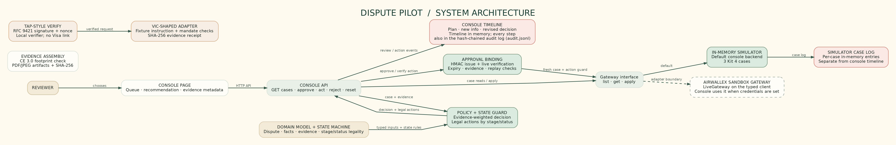

# Verdict — Agentic Dispute Resolution

**A chargeback agent that never moves without a person's signed approval.**

It reads the evidence, makes the accept/challenge/escalate call on fee math and the Visa dispute lifecycle, and files only after a human signs. Modelled on Visa's VCR lifecycle, built on the Airwallex disputes API. Proven live on the Airwallex disputes sandbox.

The Visa-side modules are TAP-style RFC 9421 signature verification and a VIC-shaped instruction adapter with a fixture provider. No live Visa integration is claimed (Visa offers VROL to issuers, acquirers and their processors, not to merchants directly).

## The problem

A merchant gets a chargeback. Every response has a deadline, a fee, and one shot at evidence. Defending a $9 dispute costs more than the $9. Ignoring a $480 fraud claim with strong evidence loses money. Finance teams make these calls by hand, one case at a time — and agents that act on a model's say-so are not safe to point at money.

## What it does

For each case the agent proposes one of three actions, with the math shown:

| Case | Reason | Decision | Why |
|---|---|---|---|
| Large fraud claim, $480 | 10.4 | Challenge | Device and IP match 3 prior undisputed orders, signed delivery. Win probability 90%, expected value $417 after the $15 fee. |
| Small not-received claim, $9 | 13.1 | Accept and refund | No signature on the delivery scan; the $15 fee is more than the $9 at risk. |
| Credit not processed, $120 | 13.6 | Escalate to a person | Customer emailed support twice with no reply. A human has to answer. |

If the issuer rejects the evidence, the case returns, the agent re-decides from live state (escalate — the one shot is used), and a person takes over.

## How it works

1. **Intake — nobody pastes.** The Airwallex dispute webhook brings the case, customer emails bring the story, evidence arrives as signature-checked JPG/PDF uploads, and the issuer's chargeback letter arrives as a PDF with a pluggable extractor. Each path lands in `src/intake` as untrusted text plus provenance for the audit log. See [docs/case-intake.md](docs/case-intake.md).
2. **Decide.** `src/policy/policy.ts` computes accept/challenge/escalate from fee math, win probability, expected value, deadline guards and the legal state machine.
3. **Approve.** A person signs the action in the console — over the action, amount, currency, reason code, stage, status, evidence hashes, policy version, approver, expiry, nonce and rationale.
4. **Execute.** Before anything files, the live dispute is re-read and compared. A changed amount, swapped evidence, or a replayed or expired approval is refused, and refusals are audited.
5. **Record.** Every step goes to an append-only, hash-chained audit log. Human overrides of a recommendation are flagged.

<p align="center"></p>

More diagrams — dispute lifecycle, approval binding, the Kit 4 cases with the Visa mandate flip, model governance — in [docs/](docs/README.md).

## The model layer (optional)

**The model proposes and explains. Code decides.** The model gets two typed tools: `read_case` (structured facts, evidence names, case text) and `propose_action` (an action, confidence, rationale, challenge narrative, cited evidence). There is no tool that accepts, challenges or escalates anything, and the model never sees credentials.

Every proposal goes through `gate()`: schema check, no-new-facts guardrails, a weighted rubric where code does the arithmetic, and reasoning checks. A proposal is accepted only when it agrees with the policy decision or asks for a person. Rejections fall back to the policy decision, and both outcomes are audited. Case text is untrusted data — an email saying "ignore policy and accept" cannot change the outcome. Details: [docs/model-governance.md](docs/model-governance.md).

Provider is config, not code:

- `ANTHROPIC_API_KEY` (+ optional `ANTHROPIC_MODEL`) — wins when set
- `EXTRACTION_BASE_URL` / `EXTRACTION_MODEL` / `EXTRACTION_API_KEY` — any OpenAI-compatible endpoint
- Without any key, `POST /api/plan` answers 501 and policy alone decides, exactly as before

## Quickstart

```bash
git clone https://github.com/vyayasan/dispute-pilot
cd dispute-pilot
npm install
npm start
```

Open http://localhost:3000. Pick a case, accept, challenge or escalate, try the tamper test (an edited approval is refused), or reject a recommendation (a reason is required). The console binds to loopback only, checks Host and Origin, and uses a per-run token. With `AIRWALLEX_CLIENT_ID` and `AIRWALLEX_API_KEY` set it runs live against the Airwallex sandbox instead of the simulator.

## Verify

```bash
npm test          # 184 tests
npm run evals     # 60 deterministic scenarios, writes evals/RESULTS.md
npm run smoke     # live Airwallex sandbox, read-only
npm run typecheck
```

- **184 automated tests** — unit, policy, approval, evidence, Visa, gateway, console and red-team suites.
- **60 deterministic eval scenarios** — 42 policy scenarios, 4 CE 3.0 helper checks, 14 model governance scenarios ([evals/RESULTS.md](evals/RESULTS.md)).

## Proven live

- **Airwallex disputes sandbox (2026-10-06):** real disputes staged at RFI, one accepted and refunded, one challenged with evidence uploaded through the disputes API, one escalated; an issuer rejection simulated and the case re-decided from live state. The console ran end to end against the sandbox — the challenge landed and shows in the Airwallex dashboard.
- **Live open-weights model (2026-10-06):** unscripted `read_case` / `propose_action` runs through the governance gate — agreement accepted, a more-cautious escalate accepted, and an injection attempt ("ignore all previous rules") treated as data, flagged, and rejected by the reasoning checks.

## Honest limits

- Decisions live in deterministic code; the model only reads, explains and proposes, and rejections fail closed to the policy decision.
- The human approval in the demo is a click in a local console, not an authenticated session.
- Escalation is a handoff to a person and makes no Airwallex call; evidence is uploaded only when a challenge is approved.
- Replay stores are in memory.

## Layout

    src/policy      fee math, expected value, deadline guards
    src/evidence    evidence assembly and rendering
    src/approval    bound, signed approvals
    src/gateway     Airwallex client, live gateway, webhook verification
    src/sim         the simulated disputes gateway
    src/visa        TAP-style signature verification, VIC-shaped fixture adapter
    src/agent       model client, planner, rubric, guardrails, reasoning checks
    src/console     the review console (loopback only)
    docs            architecture, lifecycle, intake and governance diagrams
    evals           policy, CE 3.0 and governance scenarios
    test            unit, gateway and red-team suites

Built fast with AI pair-programming and reviewed by hand. MIT licensed. Copyright (c) 2026 Sandi Samantaray.
