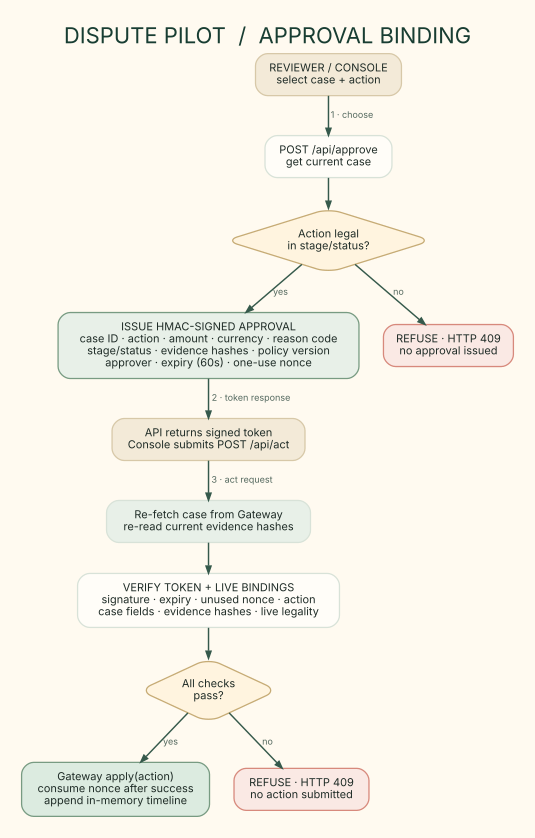

# Approval-binding sequence



PNG export: [3-approval-binding.png](./3-approval-binding.png)

```mermaid
sequenceDiagram
  actor Reviewer
  participant UI as Console page
  participant API as Console API
  participant GW as Current Gateway case
  participant V as ApprovalVerifier
  Reviewer->>UI: Choose dispute + action
  UI->>API: POST /api/approve {disputeId, action}
  API->>GW: get(disputeId)
  API->>API: Check action legal in current stage/status
  API->>V: issue signed approval (60 s TTL)
  V-->>UI: Token bound to case, action, evidence, policy and approver
  UI->>API: POST /api/act {approval}
  API->>GW: get(disputeId) again (current case)
  API->>V: check signature, expiry, nonce, action + live bindings
  alt All checks pass
    API->>GW: apply(action)
    API->>V: consume nonce after successful apply
    API->>API: Append in-memory timeline event
    API-->>UI: Result + refreshed case
  else Any check fails
    API-->>UI: 409 refusal; no gateway action
  end
```

## Approval boundary

The HMAC-signed token binds the dispute ID, selected action, amount, currency, reason code, stage, status, sorted evidence SHA-256 list, policy version, approver, expiry and one-use nonce. Before execution, the verifier checks the signature, reuse and expiry, selected action, matching current dispute fields, legality in current state, and the current evidence hashes. It refuses rather than proceeding when a binding no longer matches.

The sequence's “live” read is a fresh `gateway.get()` call. In the console this reads the simulator, or the Airwallex sandbox through `LiveGateway` when credentials are set; a production/live Airwallex gateway adapter is not wired in. The verifier's replay set is also process-local. The diagram documents implemented control flow, not a production deployment guarantee.
