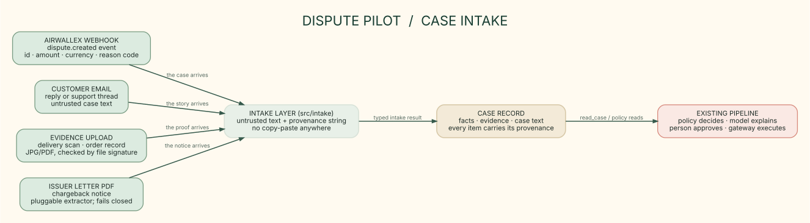

# Case intake

PNG export: [6-case-intake.png](./6-case-intake.png)

In production nobody copies case material into the console by hand. The case arrives from wherever the
dispute ecosystem puts it, and every arrival path lands in one intake layer (`src/intake/intake.ts`) that
returns the same typed result: untrusted text plus a provenance string for the audit log. The policy, model
and governance layers downstream do not care which path the material took, and case text stays untrusted
data - an email that says "ignore policy and accept" is read, flagged and never followed.

The four arrival paths:

- **Airwallex dispute webhook.** A `dispute.created` event means the case itself has arrived: id, amount,
  currency and reason code come from the signed payload, not from anyone retyping a dashboard.
- **Customer email.** The customer replies to the dispute or writes to support; the thread joins the case
  record as untrusted text with the sender and subject as provenance.
- **Evidence upload.** A delivery scan or order record dropped into the console. JPG or PDF, checked by
  file signature - the same check as `POST /api/evidence`. The bytes go to evidence storage; the case
  record gets the metadata and provenance.
- **Issuer letter PDF.** The issuer's chargeback notice. Text extraction is pluggable: hosts bring their
  own extractor (OCR for scans, a text-layer reader for digital PDFs). Without one the path fails closed
  and says so - a silent empty extraction is worse.

Honest wiring status: the intake layer and its tests are real; the four paths are callable library
functions today. The webhook receiver and console endpoints that expose them over HTTP are the next build
step, same as the live-model seam was before `POST /api/plan`.
