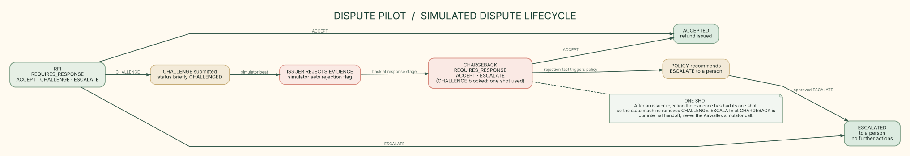
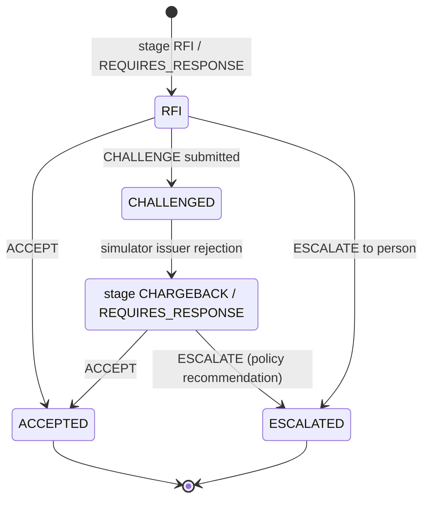

# Dispute lifecycle

PNG export: [2-dispute-lifecycle.png](./2-dispute-lifecycle.png)

## Source-grounded transition notes

- At `RFI / REQUIRES_RESPONSE` the guard allows `ACCEPT`, `CHALLENGE` and `ESCALATE`. A challenge sets `CHALLENGED` briefly; the simulator then models the issuer rejection by returning the dispute to `CHARGEBACK / REQUIRES_RESPONSE` and setting `evidenceRejectedByBank`.
- That fact makes `decide()` recommend `ESCALATE`, and `legalActions()` now matches: at `CHARGEBACK` it returns `ACCEPT` and `ESCALATE`, and `CHALLENGE` is removed once the bank has rejected the evidence (Visa gives one shot). `ESCALATE` at `CHARGEBACK` is our internal handoff to a person, not a call to the Airwallex escalate simulator, which rejects that transition.
- An escalated case moves to status `ESCALATED` and offers no further actions.
- The console records "New information" and "Revised decision" for the issuer rejection, and "Override" when a reviewer picks an action that differs from the recommendation. Every step is also written to the hash-chained audit log (`src/audit/audit.ts`).
- Other guards: if status is not `REQUIRES_RESPONSE` there are no legal actions; stages other than `RFI` and `CHARGEBACK` allow only `ESCALATE`.
