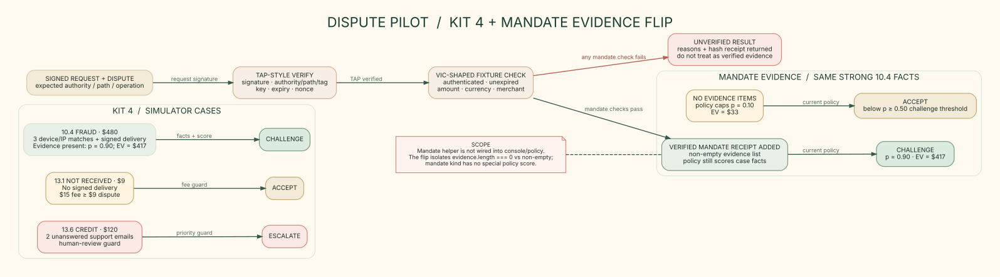
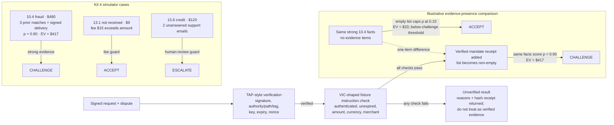

# Kit 4 cases and mandate-evidence flip

PNG export: [4-kit4-and-mandate.png](./4-kit4-and-mandate.png)

## Case branches from code and tests

| Scenario | Inputs that drive the branch | Recommendation |
|---|---|---|
| Strong fraud (`10.4`) | $480, three matching prior device/IP orders, signed delivery, evidence present | `CHALLENGE`; p = 0.90 and expected value = $417 at the default $15 fee |
| Small not-received (`13.1`) | $9, no signature; $15 fee is at least the dispute amount | `ACCEPT` |
| Credit not processed (`13.6`) | $120 and two unanswered support emails | `ESCALATE` to a person |

The first three branches are the simulator cases and `test/policy.test.ts` “kit 4 scenarios”. Policy guards run before the fee/value checks: bank rejection, enough unanswered emails, amount above the $1,000 autonomy cap, or fewer than four hours to deadline can force `ESCALATE`. For non-empty evidence, the policy's probability calculation uses reason code and case facts; it does not assign a score to `EvidenceItem.kind`.

## Mandate evidence: what the comparison does and does not show

The local TAP verifier checks the RFC 9421-style signature, authority/path/tag binding, signing key and algorithm, time window, and nonce replay. The fixture-backed VIC-shaped adapter then checks authenticated instruction status, expiry, dispute amount and currency, and optional merchant match; it returns `verified`, reasons and a SHA-256 `EvidenceItem` receipt.

The side-by-side uses the same strong fraud facts to isolate a code-level hinge: an **empty** evidence array caps win probability at 0.10, while a non-empty array allows the fact-based 0.90 calculation. With the demo amount/fee those produce accept ($33 expected value but below the challenge probability threshold) versus challenge ($417). This does **not** mean a mandate by itself proves fraud, nor that mandate evidence has its own policy score. `mandateEvidence()` returns a hash receipt even when `verified` is false, alongside reasons; callers must check the boolean and must not treat a failed result as verified evidence. The current code does not wire `mandateEvidence()` into the simulator or console policy flow; it is an illustrative counterfactual. In an invalid mandate case, the caller must use `verified` and should not treat the returned hash receipt alone as verified evidence.
