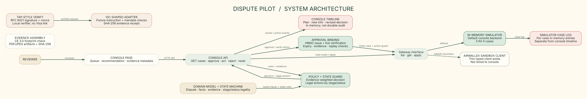
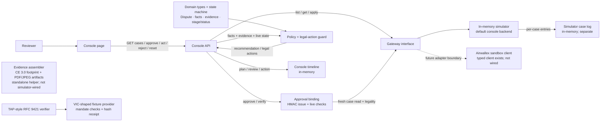
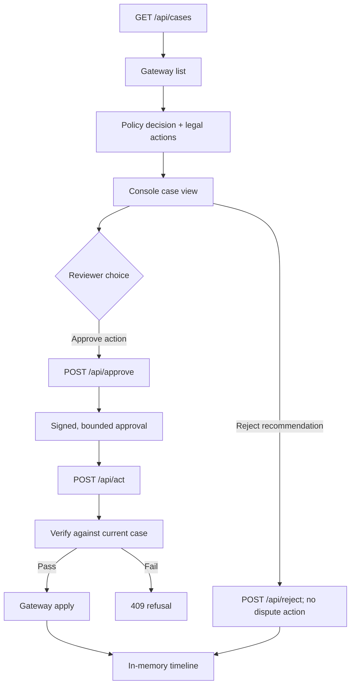

# System architecture

PNG export: [1-system-architecture.png](./1-system-architecture.png)

## What the code does

- The browser console presents the queue, server recommendation, evidence metadata and case timeline. The console API handles case reads, action approval, execution, reviewer rejection and demo reset.
- `Gateway` is declared in `src/sim/simGateway.ts`; the console defaults to that in-memory implementation. The separate `AirwallexClient` in `src/gateway/airwallex.ts` has typed sandbox reads and accept/challenge/simulation methods but is not plugged into the console's gateway interface.
- Policy scoring, policy thresholds and stage/status legality live in code. The API obtains case state through the gateway before approving or executing a response.
- Evidence assembly can make deterministic PDF/JPEG artifacts and hashes and checks the CE 3.0 prior-order footprint. The console simulator displays evidence metadata, not evidence file contents.
- TAP and VIC-shaped mandate verification are local helpers, separate from the current console flow. TAP binds a signed request and consumes a nonce; the fixture-backed instruction check emits an `EvidenceItem` hash receipt. The repository makes no claim of live Visa integration.
- Audit: `src/audit/audit.ts` is an append-only, hash-chained JSONL log (approval issued, refused, override, executed, outcome unknown, reset). The console timeline is the in-memory UI view of the same story.

